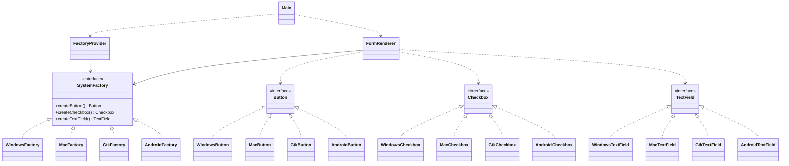

# Assignment 2 – Report: Factory Method & Abstract Factory

**Course:** Software Design Patterns
**Presenter:** Abdulla Nurdaulet

---

## 1. Part A – Start Without Factories

### The Problem: Object Creation Without a Pattern

Before applying any creational pattern, the client code instantiated OS-specific components directly, using string checks to decide which concrete class to build:

```java
String osType = "Windows";

WindowsButton winButton = null;
MacCheckbox macCheckbox = null;

if (osType.equalsIgnoreCase("Windows")) {
    winButton = new WindowsButton();
} else if (osType.equalsIgnoreCase("Mac")) {
    macCheckbox = new MacCheckbox();
}

if (osType.equalsIgnoreCase("Windows") && winButton != null) {
    winButton.renderWindowsButton();
} else if (osType.equalsIgnoreCase("Mac") && macCheckbox != null) {
    macCheckbox.renderMacCheckbox();
}
```

### Key Design Problems Identified

1. **Single Responsibility Principle violated.** The client both decides *which* class to build and *uses* it. Any change in instantiation (e.g. `new WindowsButton()` needing a theme color parameter) forces changes in core application logic.
2. **No polymorphism.** The client cannot keep widgets in a generic `List<Button>` or call one unified `render()`. It must know every concrete class and its OS-specific method names (`renderWindowsButton`, `renderMacCheckbox`, ...).
3. **Open/Closed Principle violated.** Supporting a new OS means finding and editing every `if/else` chain in the application.
4. **Families can be mixed by accident.** Nothing prevents a Windows button from being combined with a Mac checkbox, because the client picks each product independently.

---

## 2. Part B – Factory Method

### Applying Factory Method

The "which concrete class" decision moves out of the client and into the class hierarchy. `SystemFactory` was an abstract class declaring two factory methods, `createButton()` and `createCheckbox()`, and defining `displayForm()`: a method that assembles and drives a form using only the `Button` and `Checkbox` interfaces, with no knowledge of Windows, Mac or Gtk.

Each subclass (`WindowsFactory`, `MacFactory`, `GtkFactory`) overrides the factory methods to supply its own concrete products. Polymorphism selects the right one at runtime instead of an `if/else` chain.

This is a **Factory Method** rather than a static factory because creation is deferred to subclasses through inheritance, and the Creator (`SystemFactory`) still owns real business logic that operates on the Product interfaces.

**Limitation:** the pattern only creates one kind of product per factory method and ties business logic to the creator hierarchy. Adding a third widget means changing the abstract class and every subclass, and nothing expresses that the products belong together as a family. This motivates Part C.

---

## 3. Part C – Abstract Factory

### Applying Abstract Factory and Introducing a Product Family

Instead of creating individual products directly, the program uses a factory that creates several **related** products. Each concrete factory produces products from the same family, so they are compatible with each other.

The abstract class was replaced by the `SystemFactory` interface, which defines one creation method per product type:

```java
public interface SystemFactory {
    Button createButton();
    Checkbox createCheckbox();
    TextField createTextField();
}
```

The interface does not name any concrete class, so different concrete factories supply different product families.

**`FormRenderer`: the business-logic client.** `displayForm()` used to live inside the abstract creator. A plain interface cannot hold method bodies, so that logic moved to `FormRenderer`, which receives a `SystemFactory` in its constructor and drives the form through it. This separates *creating* widgets (factories) from *using* them (client), which is an improvement over Part B.

**`FactoryProvider`: runtime selection.** A static `createFactory(String family)` maps `"windows"`, `"mac"`, `"gtk"`/`"linux"` (and later `"android"`) to a concrete factory, case-insensitively. `null` or unknown names throw `IllegalArgumentException` with a helpful message. `Main` reads the family from the first command-line argument or the `APP_FAMILY` environment variable, defaulting to `Mac`.

### Structure



### How the Part A problems are solved

| Part A problem | Resolution |
|---|---|
| Client chooses concrete classes | Only `FactoryProvider` knows concrete factories; `FormRenderer` knows none |
| No polymorphism | All widgets are used through `Button`, `Checkbox`, `TextField` with uniform `render()` |
| Open/Closed violated | New family = new classes + one `case` line |
| Mixed families possible | A factory only returns products of its own family |

---

## 4. Part D – Adding a Fourth Family (Android)

To check that the design really is open for extension, an **Android** family was added:

* New classes: `AndroidButton`, `AndroidCheckbox`, `AndroidTextField` (package `model.Android`) and `AndroidFactory`.
* One new `case "android"` in `FactoryProvider` and an updated error message.

**Not changed:** `FormRenderer`, `SystemFactory`, `Button`, `Checkbox`, `TextField`, `Main`, and all existing families. The unchanged client renders the Android form correctly, which is the practical proof of the Open/Closed Principle.

---

## 5. Testing

The suite uses JUnit 5 (run with `mvn test`) and contains 37 test methods (43 executed cases, counting parameterized runs). `ConsoleCapture` redirects `System.out` so tests can assert on what the widgets and the client actually print, which means the tests check behavior and not only constructors or getters.

| Area | Test class | What it verifies |
|---|---|---|
| Family creation | `FactoryCreationTest` | Each original factory returns a complete, non-null family; each call returns a fresh instance |
| Concrete products | `ConcreteProductTest` | Each factory returns exactly its own button, checkbox and text field classes |
| Compatibility | `CompatibilityTest` | All products of a factory share one family package and one output tag; the four families are distinct |
| Runtime selection | `RuntimeSelectionTest`, `MainTest` | Case-insensitive lookup, `linux`/`gtk` alias, CLI argument selection, same client giving different output per family |
| Business behavior | `FormRendererBehaviorTest` | Render order, interaction order (type → toggle → click), lifecycle messages, no cross-family output, repeatability |
| Negative scenarios | `NegativeScenarioTest` | Unknown, `null`, empty, blank and space-padded family names rejected; `FormRenderer(null)` fails on use |
| Fourth family | `FourthFamilyTest` | Android products, runtime selection, Android-specific output, unmodified client works with Android |
| Client abstraction | `ClientAbstractionTest` | A test-only factory with proxy-based products works with `FormRenderer`; the client's fields and constructor use interfaces only |

### Notes on pinned behavior

* `" windows "` (with spaces) is rejected because `FactoryProvider` does not trim input.
* `new FormRenderer(null)` only fails when `displayForm()` runs, since the constructor has no null check. Adding `Objects.requireNonNull` would make it fail earlier, and the test would need to move to the constructor call.

---

## 6. Conclusion

| Stage | Result |
|---|---|
| Part A | Direct instantiation coupled the client to every concrete class and broke SRP, OCP and polymorphism |
| Part B | Factory Method moved creation into subclasses, but handled products one at a time and mixed creation with business logic |
| Part C | Abstract Factory guarantees compatible product families and lets `FormRenderer` depend only on abstractions |
| Part D | Android was added with new classes and a single `case`, with no edits to the client or the interfaces |

The final design keeps a clear separation of responsibilities: **products** know how to render themselves, **factories** know which products belong together, **`FactoryProvider`** knows how to choose a factory, and **`FormRenderer`** knows only the abstractions.